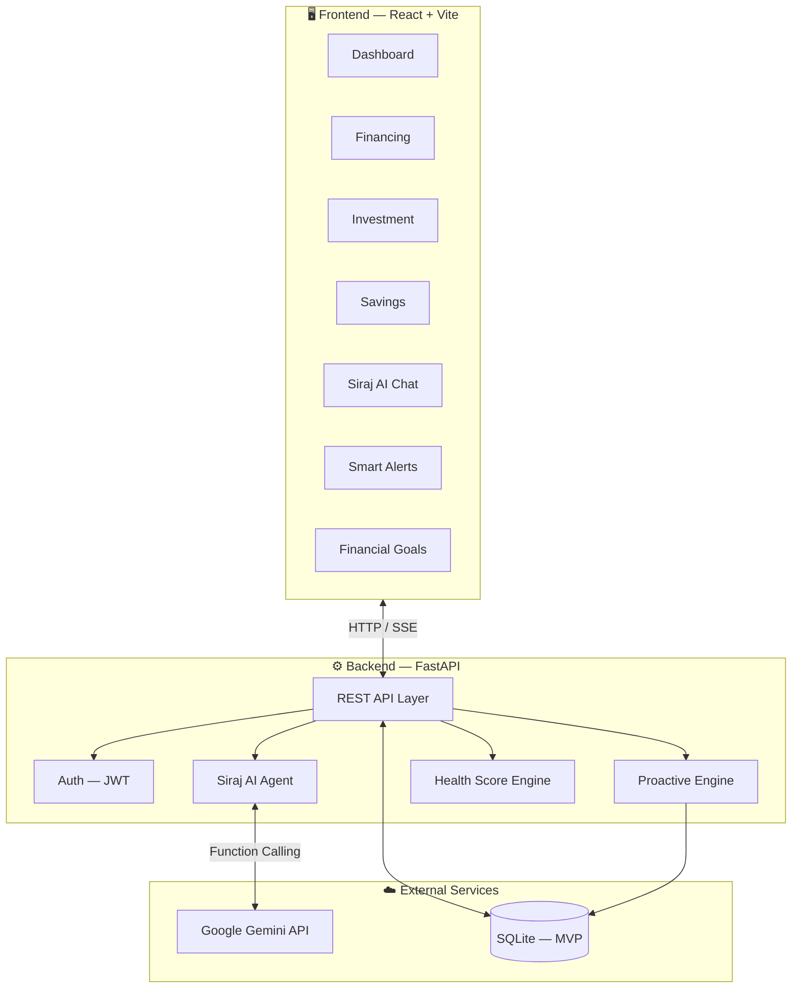
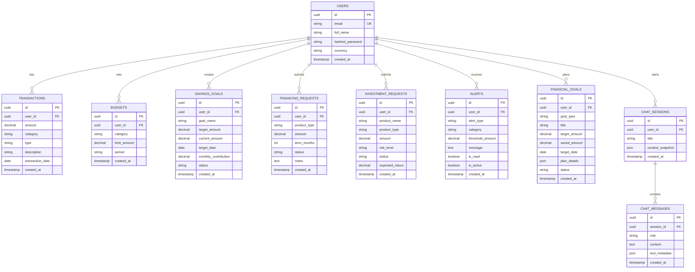
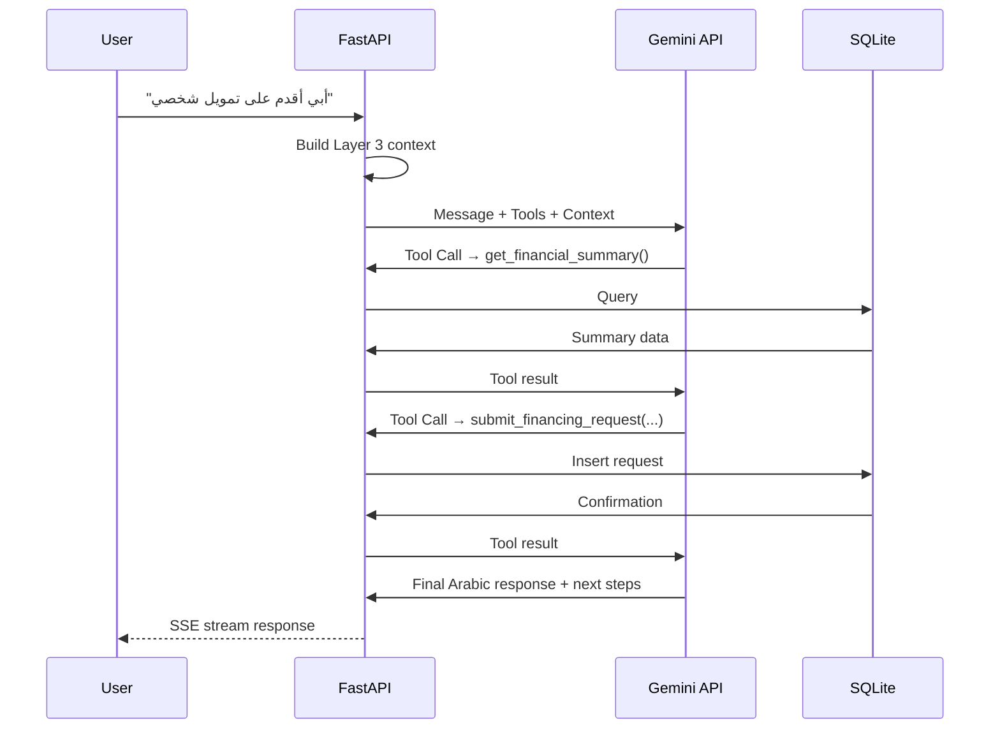
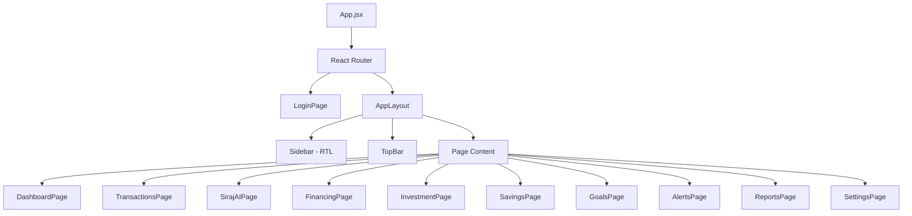

# Siraj (سراج) — Full-Stack Implementation Plan & Architecture

> **Goal**: Build an MVP for Hackathon — a smart financial advisor platform with **FastAPI** backend and **React** frontend, powered by **Google Gemini AI** with Arabic (Saudi dialect) support.

---

## High-Level Architecture



---

## User Review Required

> [!IMPORTANT]
> **Database Choice — SQLite for MVP**: For hackathon speed, I'm using **SQLite** instead of PostgreSQL. SQLite requires zero setup, ships with Python, and is perfect for demos. We can swap to PostgreSQL for production with a one-line change in SQLAlchemy config. **Is this acceptable?**

> [!IMPORTANT]
> **Authentication — Simplified JWT**: For the MVP, I'll implement basic JWT auth with email/password (no OAuth, no email verification). Registration is open. **Is this sufficient for the demo?**

> [!IMPORTANT]
> **Seed Data**: I'll create a seed script that pre-populates the database with ~120 sample transactions (matching your existing test data), sample budgets, savings goals, and financing/investment records so the demo looks realistic from the start. **Should the seed user be "سارة القرني" as shown in the UI designs?**

---

## Open Questions

> [!IMPORTANT]
> **Financing & Investment — Mock or Real?** Since this is a hackathon MVP, should financing options and investment opportunities be **mocked/seeded data**, or do you have actual external APIs you want to integrate?

> [!IMPORTANT]
> **Gemini API Key** — Do you already have a Google Gemini API key ready? The AI features depend on this.

> [!IMPORTANT]
> **Deployment Target** — Are you planning to demo locally, or do you need deployment to a cloud service (Railway, Render, Vercel)?

---

## Proposed Changes

The project will be structured as a **monorepo** under `c:\Users\saraa\Desktop\Siraj\`:

```
Siraj/
├── backend/                    # FastAPI server
│   ├── app/
│   │   ├── __init__.py
│   │   ├── main.py             # FastAPI app entry point
│   │   ├── config.py           # Settings & environment vars
│   │   ├── database.py         # SQLAlchemy engine + session
│   │   ├── models/             # SQLAlchemy ORM models
│   │   │   ├── __init__.py
│   │   │   ├── user.py
│   │   │   ├── transaction.py
│   │   │   ├── budget.py
│   │   │   ├── savings.py
│   │   │   ├── financing.py
│   │   │   ├── investment.py
│   │   │   ├── alert.py
│   │   │   ├── goal.py
│   │   │   └── chat.py
│   │   ├── schemas/            # Pydantic request/response schemas
│   │   │   ├── __init__.py
│   │   │   ├── user.py
│   │   │   ├── transaction.py
│   │   │   ├── budget.py
│   │   │   ├── savings.py
│   │   │   ├── financing.py
│   │   │   ├── investment.py
│   │   │   ├── alert.py
│   │   │   ├── goal.py
│   │   │   └── chat.py
│   │   ├── routers/            # API route handlers
│   │   │   ├── __init__.py
│   │   │   ├── auth.py
│   │   │   ├── dashboard.py
│   │   │   ├── transactions.py
│   │   │   ├── budgets.py
│   │   │   ├── savings.py
│   │   │   ├── financing.py
│   │   │   ├── investment.py
│   │   │   ├── alerts.py
│   │   │   ├── goals.py
│   │   │   └── chat.py
│   │   ├── services/           # Business logic layer
│   │   │   ├── __init__.py
│   │   │   ├── auth_service.py
│   │   │   ├── financial_service.py
│   │   │   ├── health_score.py
│   │   │   ├── alert_engine.py
│   │   │   └── ai_agent.py     # Gemini integration + tools
│   │   ├── ai/                 # AI-specific modules
│   │   │   ├── __init__.py
│   │   │   ├── system_prompt.py    # Multi-layered Arabic prompts
│   │   │   ├── tools.py            # 15+ tool definitions
│   │   │   ├── context_builder.py  # RAG context injection
│   │   │   └── agent_loop.py       # Multi-turn agentic loop
│   │   └── seed.py             # Database seeder with demo data
│   ├── requirements.txt
│   └── .env.example
│
├── frontend/                   # React + Vite
│   ├── public/
│   ├── src/
│   │   ├── main.jsx
│   │   ├── App.jsx
│   │   ├── index.css           # Global styles + design tokens
│   │   ├── api/                # API client (axios)
│   │   │   └── client.js
│   │   ├── context/            # React context providers
│   │   │   ├── AuthContext.jsx
│   │   │   └── AlertContext.jsx
│   │   ├── hooks/              # Custom hooks
│   │   │   ├── useAuth.js
│   │   │   └── useDashboard.js
│   │   ├── components/         # Reusable UI components
│   │   │   ├── Layout/
│   │   │   │   ├── Sidebar.jsx
│   │   │   │   ├── TopBar.jsx
│   │   │   │   └── AppLayout.jsx
│   │   │   ├── Dashboard/
│   │   │   │   ├── KPICards.jsx
│   │   │   │   ├── ExpenseDonut.jsx
│   │   │   │   ├── TopExpensesBar.jsx
│   │   │   │   ├── SirajTip.jsx
│   │   │   │   ├── HealthScoreGauge.jsx
│   │   │   │   └── RecentTransactions.jsx
│   │   │   ├── Chat/
│   │   │   │   ├── ChatPanel.jsx
│   │   │   │   ├── MessageBubble.jsx
│   │   │   │   ├── QuickActions.jsx
│   │   │   │   └── ToolIndicator.jsx
│   │   │   ├── Financing/
│   │   │   │   ├── FinancingList.jsx
│   │   │   │   ├── FinancingRequestForm.jsx
│   │   │   │   └── ApplicationStatus.jsx
│   │   │   ├── Investment/
│   │   │   │   ├── OpportunityCard.jsx
│   │   │   │   ├── InvestmentList.jsx
│   │   │   │   └── RecommendationCard.jsx
│   │   │   ├── Savings/
│   │   │   │   ├── SavingsPlanCard.jsx
│   │   │   │   ├── CreatePlanModal.jsx
│   │   │   │   └── GoalProgress.jsx
│   │   │   ├── Goals/
│   │   │   │   ├── GoalCard.jsx
│   │   │   │   ├── CreateGoalModal.jsx
│   │   │   │   └── SeasonalPlanner.jsx
│   │   │   ├── Alerts/
│   │   │   │   ├── AlertBanner.jsx
│   │   │   │   ├── AlertList.jsx
│   │   │   │   └── AlertSettingsModal.jsx
│   │   │   └── common/
│   │   │       ├── Button.jsx
│   │   │       ├── Modal.jsx
│   │   │       ├── Card.jsx
│   │   │       └── LoadingSpinner.jsx
│   │   └── pages/
│   │       ├── DashboardPage.jsx
│   │       ├── TransactionsPage.jsx
│   │       ├── SirajAIPage.jsx
│   │       ├── FinancingPage.jsx
│   │       ├── InvestmentPage.jsx
│   │       ├── SavingsPage.jsx
│   │       ├── GoalsPage.jsx
│   │       ├── AlertsPage.jsx
│   │       ├── ReportsPage.jsx
│   │       ├── SettingsPage.jsx
│   │       └── LoginPage.jsx
│   ├── package.json
│   └── vite.config.js
│
└── sirag-git/                  # Existing docs & designs (unchanged)
```

---

## Component 1: Database Layer (SQLAlchemy + SQLite)

### [NEW] `backend/app/database.py`
- SQLAlchemy async engine with SQLite
- Session factory with dependency injection for FastAPI
- `create_all_tables()` bootstrap function

### [NEW] `backend/app/models/` — ORM Models

#### Core Tables:

| Model | Table | Key Fields |
|-------|-------|------------|
| `User` | `users` | `id` (UUID), `email`, `full_name`, `hashed_password`, `currency` (default SAR), `created_at` |
| `Transaction` | `transactions` | `id`, `user_id` FK, `amount`, `category`, `type` (income/expense), `description`, `transaction_date`, `created_at` |
| `Budget` | `budgets` | `id`, `user_id` FK, `category`, `limit_amount`, `period` (monthly/weekly), `created_at` |
| `SavingsGoal` | `savings_goals` | `id`, `user_id` FK, `goal_name`, `target_amount`, `current_amount`, `target_date`, `monthly_contribution`, `status`, `created_at` |
| `FinancingRequest` | `financing_requests` | `id`, `user_id` FK, `product_type` (personal/auto/home), `amount`, `term_months`, `status` (pending/approved/rejected), `notes`, `created_at` |
| `InvestmentRequest` | `investment_requests` | `id`, `user_id` FK, `product_name`, `product_type` (fund/sukuk/ipo), `amount`, `risk_level`, `status`, `expected_return`, `created_at` |
| `Alert` | `alerts` | `id`, `user_id` FK, `alert_type` (budget_breach/spending_spike/bill_due/goal_milestone), `category`, `threshold_amount`, `message`, `is_read`, `is_active`, `created_at` |
| `FinancialGoal` | `financial_goals` | `id`, `user_id` FK, `goal_type` (hajj/umrah/marriage/travel/ramadan/eid/school), `title`, `target_amount`, `saved_amount`, `target_date`, `plan_details` (JSON), `status`, `created_at` |
| `ChatSession` | `chat_sessions` | `id`, `user_id` FK, `title`, `context_snapshot` (JSON), `created_at` |
| `ChatMessage` | `chat_messages` | `id`, `session_id` FK, `role` (user/assistant/tool_call/tool_result), `content`, `tool_metadata` (JSON), `created_at` |

#### ERD:



---

## Component 2: Backend — FastAPI API Layer

### [NEW] `backend/app/main.py`
- FastAPI app with CORS middleware (allow React dev server)
- Lifespan handler to create tables on startup and seed demo data
- Mount all routers under `/api/v1/`

### [NEW] `backend/app/config.py`
- Pydantic `Settings` class reading from `.env`
- Keys: `DATABASE_URL`, `GEMINI_API_KEY`, `JWT_SECRET`, `JWT_ALGORITHM`, `JWT_EXPIRE_MINUTES`

### API Endpoints:

#### Auth (`/api/v1/auth/`)
| Method | Endpoint | Description |
|--------|----------|-------------|
| POST | `/register` | Register new user |
| POST | `/login` | Login → returns JWT token |
| GET | `/me` | Get current user profile |

#### Dashboard (`/api/v1/dashboard/`)
| Method | Endpoint | Description |
|--------|----------|-------------|
| GET | `/overview` | Account overview (income, expenses, savings, savings rate) |
| GET | `/category-breakdown` | Expense breakdown by category with percentages |
| GET | `/health-score` | Financial awareness/health score (0-100) |
| GET | `/daily-tip` | Personalized daily tip from Siraj (AI-generated) |
| GET | `/alerts/active` | Active budget alerts |
| GET | `/goals/summary` | Summary of financial goals progress |

#### Transactions (`/api/v1/transactions/`)
| Method | Endpoint | Description |
|--------|----------|-------------|
| GET | `/` | List transactions (filters: date range, category, type) |
| POST | `/` | Add new transaction |
| DELETE | `/{id}` | Delete a transaction |

#### Budgets (`/api/v1/budgets/`)
| Method | Endpoint | Description |
|--------|----------|-------------|
| GET | `/` | List all budgets |
| POST | `/` | Create/update budget for a category |
| GET | `/analysis` | Budget vs. actual spending comparison |

#### Financing (`/api/v1/financing/`)
| Method | Endpoint | Description |
|--------|----------|-------------|
| GET | `/products` | List available financing products (seeded) |
| POST | `/requests` | Submit a financing request |
| GET | `/requests` | List user's financing requests |
| GET | `/requests/{id}` | Get request status & details |

#### Investment (`/api/v1/investment/`)
| Method | Endpoint | Description |
|--------|----------|-------------|
| GET | `/opportunities` | List investment opportunities (seeded) |
| POST | `/requests` | Submit investment request |
| GET | `/requests` | List user's investment requests |
| GET | `/recommendations` | AI-powered personalized recommendations |

#### Savings (`/api/v1/savings/`)
| Method | Endpoint | Description |
|--------|----------|-------------|
| GET | `/plans` | List savings plans |
| POST | `/plans` | Create new savings plan |
| PUT | `/plans/{id}` | Update savings plan progress |
| GET | `/plans/{id}/progress` | Get detailed progress |

#### Goals (`/api/v1/goals/`)
| Method | Endpoint | Description |
|--------|----------|-------------|
| GET | `/` | List financial goals |
| POST | `/` | Create financial goal (Hajj, Umrah, marriage, etc.) |
| PUT | `/{id}` | Update goal |
| GET | `/templates` | Get pre-built goal templates for seasonal events |
| POST | `/{id}/plan` | Generate AI financial plan for a goal |

#### Alerts (`/api/v1/alerts/`)
| Method | Endpoint | Description |
|--------|----------|-------------|
| GET | `/` | List all alerts |
| POST | `/` | Create custom alert |
| PUT | `/{id}/read` | Mark alert as read |
| GET | `/unread-count` | Get unread alert count |

#### Chat / Siraj AI (`/api/v1/chat/`)
| Method | Endpoint | Description |
|--------|----------|-------------|
| POST | `/sessions` | Create new chat session |
| GET | `/sessions` | List chat sessions |
| POST | `/sessions/{id}/messages` | Send message → SSE streaming response |
| GET | `/sessions/{id}/messages` | Get chat history |

---

## Component 3: Siraj AI Agent (Gemini Integration)

### [NEW] `backend/app/ai/system_prompt.py`
The three-layered prompt architecture from the existing plan:

- **Layer 1 — Identity**: Arabic personality, Saudi dialect, Islamic finance awareness
- **Layer 2 — Capabilities**: What Siraj can/cannot do, guardrails
- **Layer 3 — Dynamic Context**: Injected per-request financial data

### [NEW] `backend/app/ai/tools.py`
Expanded tool suite — **15 tools** covering all 7 features:

| # | Tool | Feature Area |
|---|------|-------------|
| 1 | `get_transactions` | Dashboard / Transactions |
| 2 | `get_financial_summary` | Dashboard |
| 3 | `get_category_breakdown` | Dashboard |
| 4 | `get_budget_analysis` | Dashboard / Alerts |
| 5 | `get_recurring_charges` | Dashboard / Alerts |
| 6 | `add_transaction` | Transactions |
| 7 | `set_budget` | Budgets |
| 8 | `create_savings_plan` | Savings |
| 9 | `create_spending_alert` | Smart Alerts |
| 10 | `simulate_scenario` | Financial Planning |
| 11 | `submit_financing_request` | Financing |
| 12 | `get_financing_status` | Financing |
| 13 | `get_investment_recommendations` | Investment |
| 14 | `submit_investment_request` | Investment |
| 15 | `create_financial_goal` | Financial Goals |

### [NEW] `backend/app/ai/context_builder.py`
The RAG context injection pipeline — builds a complete financial snapshot for every chat request:

```python
def build_context(user_id: str) -> dict:
    return {
        "user_profile": ...,
        "financial_summary": ...,      # income, expenses, savings, rate
        "category_breakdown": ...,     # spending by category
        "budget_status": ...,          # budget vs actual
        "savings_goals": ...,          # active savings progress
        "financing_requests": ...,     # pending financing apps
        "investment_portfolio": ...,   # active investments
        "financial_goals": ...,        # goal progress
        "active_alerts": ...,          # unresolved alerts
        "health_score": ...,           # 0-100 score + grade
        "current_date": "2026-07-10",
        "upcoming_season": ...,        # e.g., Ramadan in 62 days
    }
```

### [NEW] `backend/app/ai/agent_loop.py`
Multi-turn agentic conversation loop:



---

## Component 4: Frontend — React + Vite

### [NEW] `frontend/` — Initialized with Vite

#### Design System (matching UI mockups):
- **Primary**: Navy blue `#1a1f4e` (sidebar/header)
- **Accent**: Copper/bronze `#c17a3a` (CTAs, highlights)
- **Text**: Dark `#1a1f4e` / White `#ffffff`
- **Background**: Light cream `#f8f6f1` / Dark mode `#0d1117`
- **Cards**: White with subtle shadow / Dark `#161b22`
- **Typography**: Arabic-first — `Cairo` or `IBM Plex Sans Arabic` from Google Fonts
- **Direction**: RTL throughout
- **Charts**: `recharts` library — donut chart + bar chart matching designs

#### Page Architecture:



#### Key Pages & Components:

**1. Dashboard Page** — Main landing page
- 4 KPI cards (Income, Expenses, Savings, Savings Rate) with sparklines
- Expense donut chart by category
- Top 5 expenses bar chart
- "نصيحة سراج" tip card (AI-generated)
- Financial Health Score gauge (0-100)
- Recent transactions table
- Savings goal progress card
- Quick action buttons (Add Transaction, Reports, Pay Bill, Transfer)
- "اسأل سراج" floating chat entry

**2. Financing Page**
- Browse financing products (personal, auto, home) as cards
- Financing request form (amount, term, type)
- Application status tracker (pending → under review → approved/rejected)

**3. Investment Page**
- Investment opportunity cards (funds, sukuk, IPO)
- Risk level indicators (low/medium/high)
- AI recommendation cards with rationale
- Investment request form
- Portfolio summary

**4. Savings Page**
- Active savings plans with progress bars
- Create plan modal (goal name, target, timeline)
- Monthly contribution tracker
- Goal achievement celebration animation

**5. Siraj AI Page** — Full chat interface
- Message bubbles (user/assistant) with RTL
- Tool execution indicators ("جاري تحليل معاملاتك...")
- Quick action chips
- Streaming response with typing indicator
- Chat session sidebar

**6. Smart Alerts Page**
- Alert feed with types: budget breach, spending spike, bill due, goal milestone
- Create custom alert form
- Alert settings (enable/disable by type)
- Unread badge in sidebar

**7. Financial Goals Page**
- Pre-built goal templates: حج, عمرة, زواج, سفر, رمضان, عيد, مدارس
- Create custom goal with AI-generated plan
- Goal cards with progress tracking
- Seasonal event timeline

---

## Component 5: Seed Data

### [NEW] `backend/app/seed.py`

Pre-populated demo data for impressive hackathon demo:

| Data | Count | Details |
|------|-------|---------|
| Demo User | 1 | سارة القرني, sara@siraj.sa |
| Transactions | 120 | 6 months of realistic SAR transactions across 8 categories |
| Budgets | 6 | Monthly limits for Housing, Food, Transport, Entertainment, Bills, Shopping |
| Savings Goals | 2 | "رحلة العمرة" (20,000 SAR, 68%) and "صندوق طوارئ" (30,000 SAR, 40%) |
| Financing Products | 5 | Personal, Auto, Home, Education, Business loans (Islamic-compliant) |
| Investment Opportunities | 4 | Saudi equity fund, sukuk, real estate fund, IPO |
| Financial Goals | 3 | Hajj, Ramadan prep, Back-to-school |
| Alerts | 5 | Mix of budget warnings, spending spikes, goal milestones |

---

## Component 6: Health Score & Proactive Engine

### [NEW] `backend/app/services/health_score.py`

Weighted scoring algorithm (from existing plan):

| Factor | Weight |
|--------|--------|
| Savings Rate | 30% |
| Budget Adherence | 25% |
| Spending Consistency | 15% |
| Subscription Efficiency | 10% |
| Emergency Fund | 10% |
| Debt-to-Income | 10% |

### [NEW] `backend/app/services/alert_engine.py`

Proactive intelligence (simplified for MVP):
- **Budget breach check**: Triggered on every new transaction
- **Daily tip generation**: AI-generated tip based on user's current financial state
- **Goal milestone alerts**: Check progress on savings/financial goals

---

## Execution Phases

### Phase 1: Backend Foundation (Day 1 — ~4 hours)

| # | Task | Files |
|---|------|-------|
| 1 | Project setup, `requirements.txt`, `.env` | `backend/` root |
| 2 | Database engine + all 10 ORM models | `database.py`, `models/*.py` |
| 3 | Pydantic schemas for all models | `schemas/*.py` |
| 4 | Auth system (register, login, JWT) | `routers/auth.py`, `services/auth_service.py` |
| 5 | Core CRUD routers (transactions, budgets, savings, goals) | `routers/*.py` |
| 6 | Financing & Investment routers | `routers/financing.py`, `routers/investment.py` |
| 7 | Dashboard aggregation endpoint | `routers/dashboard.py`, `services/financial_service.py` |
| 8 | Health score endpoint | `services/health_score.py` |
| 9 | Alerts system | `routers/alerts.py`, `services/alert_engine.py` |
| 10 | Seed script | `seed.py` |

### Phase 2: AI Agent Integration (Day 1-2 — ~3 hours)

| # | Task | Files |
|---|------|-------|
| 1 | System prompt (3 layers, Arabic) | `ai/system_prompt.py` |
| 2 | Tool definitions (15 tools) | `ai/tools.py` |
| 3 | Context builder (RAG injection) | `ai/context_builder.py` |
| 4 | Agentic loop with multi-tool chaining | `ai/agent_loop.py` |
| 5 | Chat router with SSE streaming | `routers/chat.py` |
| 6 | AI-powered recommendations endpoint | `routers/investment.py` |
| 7 | AI-powered goal plan generation | `routers/goals.py` |

### Phase 3: Frontend Foundation (Day 2 — ~4 hours)

| # | Task | Files |
|---|------|-------|
| 1 | Vite + React project init | `frontend/` |
| 2 | Design system (CSS tokens, fonts, RTL) | `index.css` |
| 3 | App layout (Sidebar, TopBar, routing) | `components/Layout/`, `App.jsx` |
| 4 | Login page | `pages/LoginPage.jsx` |
| 5 | API client (axios + JWT interceptor) | `api/client.js` |
| 6 | Auth context provider | `context/AuthContext.jsx` |

### Phase 4: Frontend Feature Pages (Day 2-3 — ~5 hours)

| # | Task | Files |
|---|------|-------|
| 1 | Dashboard page (KPIs, charts, tips, score) | `pages/DashboardPage.jsx`, `components/Dashboard/` |
| 2 | Transactions page | `pages/TransactionsPage.jsx` |
| 3 | Financing page (browse, request, track) | `pages/FinancingPage.jsx`, `components/Financing/` |
| 4 | Investment page (explore, request, recommend) | `pages/InvestmentPage.jsx`, `components/Investment/` |
| 5 | Savings page (plans, progress, goals) | `pages/SavingsPage.jsx`, `components/Savings/` |
| 6 | Financial Goals page (templates, create, plan) | `pages/GoalsPage.jsx`, `components/Goals/` |
| 7 | Smart Alerts page | `pages/AlertsPage.jsx`, `components/Alerts/` |

### Phase 5: Siraj AI Chat & Polish (Day 3 — ~4 hours)

| # | Task | Files |
|---|------|-------|
| 1 | Siraj AI chat page (streaming, tools indicator) | `pages/SirajAIPage.jsx`, `components/Chat/` |
| 2 | Quick action chips | `components/Chat/QuickActions.jsx` |
| 3 | Alert notifications in sidebar/topbar | `components/Layout/`, `context/AlertContext.jsx` |
| 4 | Dark/light mode toggle | `App.jsx`, `index.css` |
| 5 | Animations & micro-interactions | All component files |
| 6 | Responsive design polish | All CSS |
| 7 | Final testing & bug fixes | — |

---

## Tech Stack Summary

| Layer | Technology |
|-------|-----------|
| **Backend** | Python 3.11+, FastAPI, SQLAlchemy, Pydantic v2, python-jose (JWT) |
| **Database** | SQLite (MVP) → PostgreSQL (production) |
| **AI** | Google Gemini API (gemini-2.0-flash), google-genai SDK |
| **Frontend** | React 18, Vite, React Router v6, Recharts, Axios |
| **Styling** | Vanilla CSS with CSS custom properties, Google Fonts (Cairo) |
| **Auth** | JWT Bearer tokens |
| **Streaming** | Server-Sent Events (SSE) |

---

## Verification Plan

### Automated Tests
- `pytest` for backend:
  - CRUD operations on all 10 models
  - Auth flow (register → login → protected route)
  - Health score calculation with known test data
  - Tool execution with mock data

### Manual Verification
- Full demo flow: Login → Dashboard → Browse financing → Ask Siraj about savings → Create goal → Check alerts
- Saudi dialect test: Send 10+ Arabic messages to Siraj and verify correct intent extraction
- Streaming test: Verify SSE chat responses stream token-by-token
- RTL layout: Verify all pages render correctly in RTL
- Dark/light mode: Toggle and verify all components adapt
- Responsive: Check mobile and desktop layouts

### Demo Script for Hackathon
1. Open Dashboard → show KPIs, charts, health score
2. Navigate to Financing → browse products → submit request
3. Navigate to Savings → create "رحلة العمرة" plan
4. Open Siraj AI → ask "وين راحت فلوسي؟" → watch multi-tool analysis
5. Ask Siraj "أبي أخطط لرمضان" → watch goal creation
6. Show Smart Alerts → budget breach notification
7. Toggle dark/light mode → show premium design
