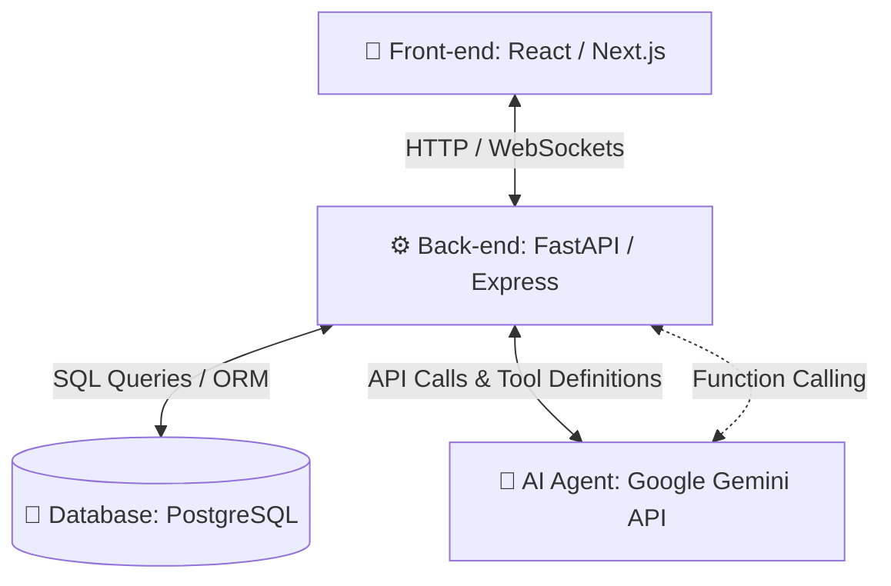
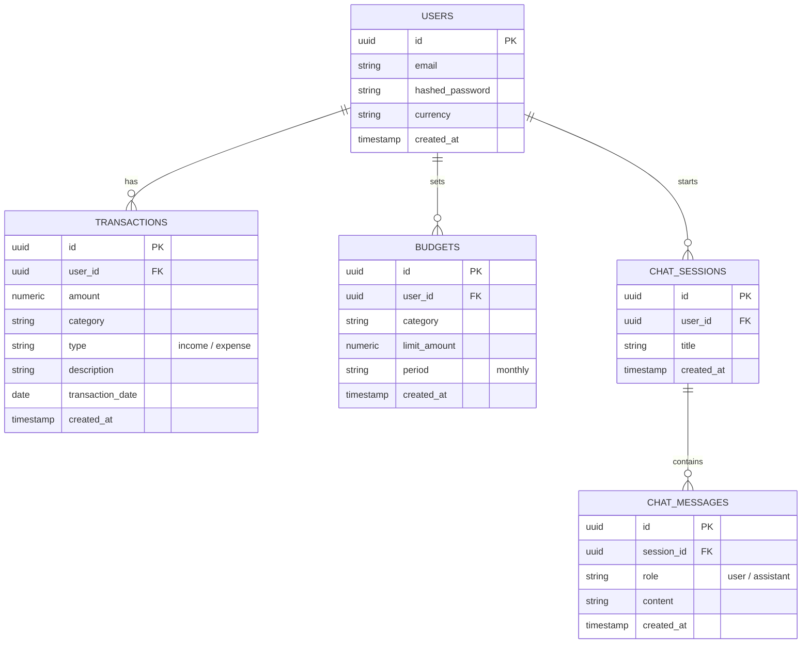

# Architecture & Implementation Plan: Siraj (سراج) Financial Agent

This document outlines the architecture, database design, AI agent integration, and step-by-step implementation plan for building the **Siraj (سراج)** Smart Financial Advisor application.

---

## 🏗️ 1. System Architecture

The application will follow a modern three-tier web architecture:

### Component Details
*   **Front-end**: A responsive web dashboard using React/Next.js and Tailwind CSS. It uses Chart.js or Recharts to visualize income, expenses, and savings. It also features a real-time chat interface.
*   **Back-end**: An API service built using **FastAPI (Python)** or **Node.js (Express)**. FastAPI is recommended due to its native support for Python-based AI frameworks, Pydantic data validation, and high performance.
*   **Database (DB)**: **PostgreSQL** is recommended. Financial transactions are relational, structured, and require strict ACID compliance. We will use an ORM (Prisma for Node.js or SQLAlchemy/SQLModel for Python).
*   **AI Agent (Agent مالي)**: Driven by the **Google Gemini API** (using models like Gemini 1.5 Pro or Gemini 2.0 Flash) configured with system instructions tailored for financial advice in Arabic, utilizing **Function Calling** to interact with the database.

---

## 💾 2. Database Design (PostgreSQL)

To store user transactions, budget settings, and chat history, we require the following relational schema:

### 📊 Entity Relationship Diagram (ERD)

---

## 🤖 3. AI Agent (Agent مالي) Integration Design

The financial agent needs to be smart, contextual, and capable of executing actions (like adding a transaction or analyzing data). We achieve this through:

### A. System Instructions (Arabic Financial Advisor Role)
Configure the Gemini model with a precise system prompt:
> **Arabic System Prompt:**
> "أنت سراج، مستشار مالي شخصي ذكي ودود. مهمتك هي مساعدة المستخدم في إدارة ميزانيته، تحليل مصروفاته، وتقديم نصائح ادخار عملية وذكية باللغة العربية بلهجة مهنية ومبسطة. يمكنك استخدام الأدوات (Functions) المتاحة لك لقراءة وإضافة المعاملات المالية والميزانيات الخاصة بالمستخدم عند طلب ذلك."

### B. Tool Use / Function Calling (أدوات الوكيل المالي)
Instead of forcing the LLM to write database queries, we expose secure API functions as tools to the Gemini API:

| Tool (Function) Name | Description | Parameters |
| :--- | :--- | :--- |
| `get_transactions(start_date, end_date, category)` | Fetches transactions for context analysis. | `start_date` (string), `end_date` (string), `category` (optional string) |
| `add_transaction(amount, category, type, description, date)` | Inserts a new transaction directly from the chat. | `amount` (number), `category` (string), `type` (string), `description` (string), `date` (string) |
| `get_budget_analysis()` | Compares total expenses against category budgets. | None |

---

## 🚀 4. Step-by-Step Implementation Plan

### Phase 1: Database & Backend Foundation
1.  **Initialize Project Directory**: Set up the backend structure (`/backend`).
2.  **Database Provisioning**: Start a local or cloud PostgreSQL database.
3.  **ORM & Migration Setup**: Install SQLAlchemy/SQLModel (Python) or Prisma (Node.js) and run migrations to create the tables.
4.  **Core REST APIs**:
    *   `POST /api/auth/register` & `POST /api/auth/login` (User auth)
    *   `GET` & `POST /api/transactions` (List and add transactions)
    *   `GET` & `POST /api/budgets` (Get and set budget limits)

### Phase 2: Front-end Dashboard & UI Layout
1.  **Initialize Next.js App**: Run `npx create-next-app@latest ./frontend` using TypeScript & Tailwind CSS.
2.  **Layout & Navigation**: Create a premium dark/navy styled sidebar and top header matching the "Siraj" theme in your screenshots.
3.  **Dashboard Widgets**:
    *   Metrics cards: Total Income (إجمالي الدخل), Total Expenses (إجمالي المصروفات), Net Savings (صافي الادخار المتبقي).
    *   Charts: Use `recharts` for the pie chart ("توزيع المصروفات حسب الفئة") and bar chart ("أعلى 5 مصروفات").
4.  **Transaction Log Table**: Build a paginated table displaying recent transactions with category badges.

### Phase 3: AI Agent Integration
1.  **Gemini API Setup**: Integrate `@google/generative-ai` (Node.js) or `google-generativeai` (Python).
2.  **Implement Chat API**: Setup `POST /api/chat` which maintains chat history in the DB.
3.  **Function Calling Implementation**: Write backend handlers for `get_transactions`, `add_transaction`, and `get_budget_analysis`, and register them as tools in the Gemini SDK.

### Phase 4: Frontend Chat Interface & Micro-interactions
1.  **Chat Drawer / Page**: Create a chat interface panel featuring a clean messaging layout.
2.  **Quick Action Chips**: Implement clickable buttons for pre-configured questions like:
    *   *“كيف يمكنني ادخار 20% من الراتب هذا الشهر؟”*
    *   *“حلل لي مصروفات المطاعم والمقاهي واقترح سقفاً لها”*
3.  **Visual Polish**: Add smooth animations (e.g., slide-in chat drawers, pulsing budget warning indicators, hover effects).

---

## 🚦 5. Verification Plan

### Automated Tests
*   **Backend Unit Tests**: Verify database CRUD functions.
*   **AI Tool Execution Tests**: Run mock Gemini responses to verify function definitions are successfully parsed and executed.

### Manual Verification
*   **UI Test**: Confirm the charts render correctly with dynamic data.
*   **Transaction Sync Test**: Add a transaction via the chat: *"أضف مصروف بقيمة 50 ريال للقهوة"* and ensure it appears on the dashboard dashboard charts immediately.
