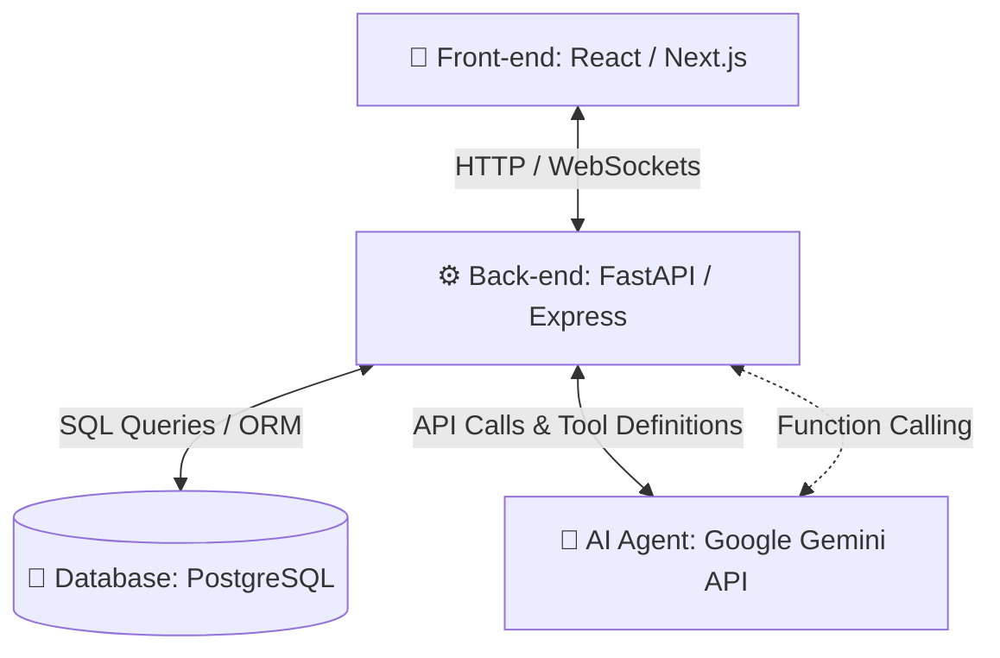
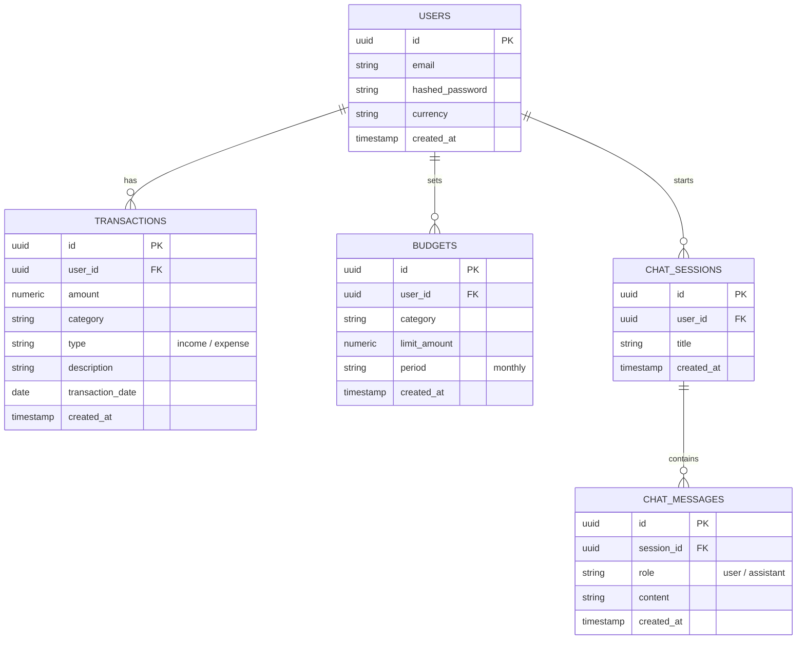
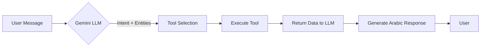
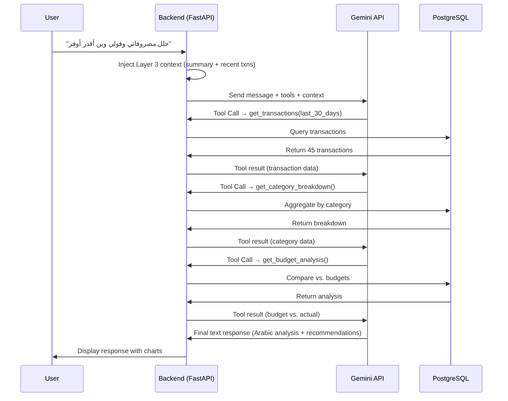
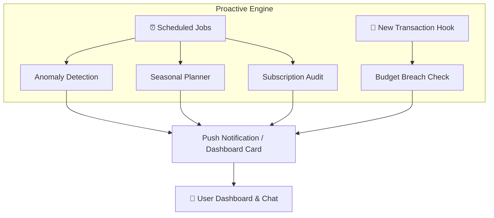
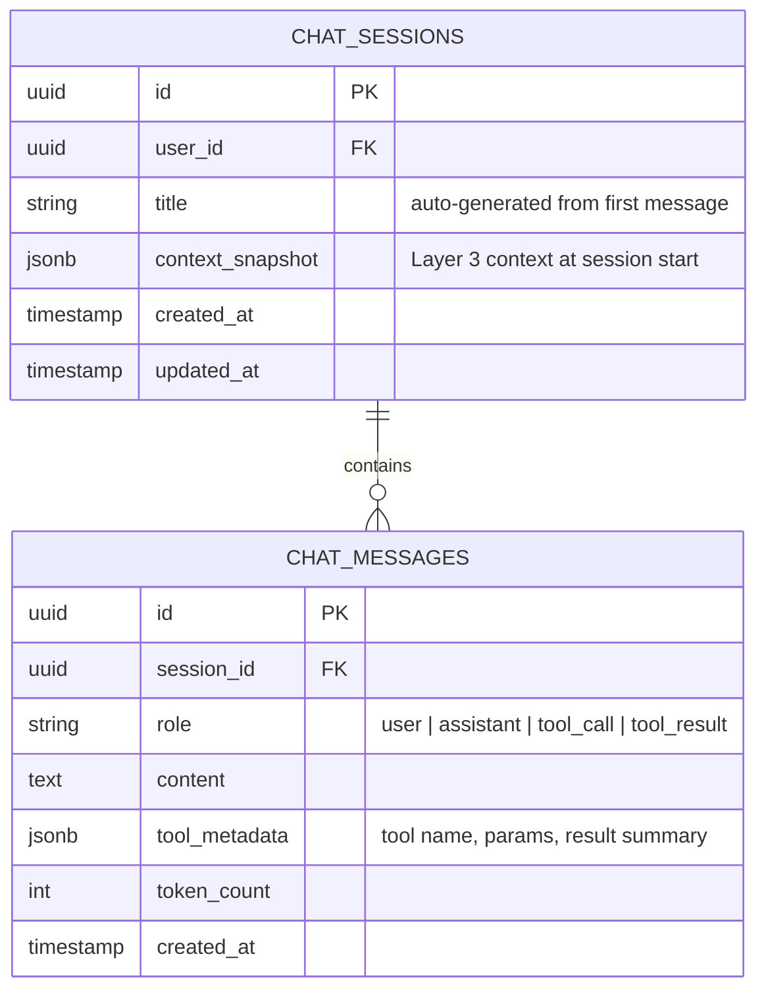

# Architecture & Implementation Plan: Siraj (سراج) Financial Agent

This document outlines the architecture, database design, AI agent integration, and step-by-step implementation plan for building the **Siraj (سراج)** Smart Financial Advisor application.

---

## 🏗️ 1. System Architecture

The application will follow a modern three-tier web architecture:



### Component Details
*   **Front-end**: A responsive web dashboard using React/Next.js and Tailwind CSS. It uses Chart.js or Recharts to visualize income, expenses, and savings. It also features a real-time chat interface.
*   **Back-end**: An API service built using **FastAPI (Python)** or **Node.js (Express)**. FastAPI is recommended due to its native support for Python-based AI frameworks, Pydantic data validation, and high performance.
*   **Database (DB)**: **PostgreSQL** is recommended. Financial transactions are relational, structured, and require strict ACID compliance. We will use an ORM (Prisma for Node.js or SQLAlchemy/SQLModel for Python).
*   **AI Agent (Agent مالي)**: Driven by the **Google Gemini API** (using models like Gemini 1.5 Pro or Gemini 2.0 Flash) configured with system instructions tailored for financial advice in Arabic, utilizing **Function Calling** to interact with the database.

---

## 💾 2. Database Design (PostgreSQL)

To store user transactions, budget settings, and chat history, we require the following relational schema:

### 📊 Entity Relationship Diagram (ERD)



---

## 🤖 3. AI Agent (سراج — Siraj) Integration Design

Siraj is not a simple chatbot. It is a **multi-tool agentic AI financial copilot** that understands Saudi dialect, executes actions on the user's data, detects spending anomalies proactively, and delivers culturally-aware Arabic advice grounded in Islamic finance principles.

---

### A. Multi-Layered System Prompt Architecture

The AI agent is configured with a **layered prompt** that separates identity, capabilities, and dynamic context:

```
┌─────────────────────────────────────────────────────┐
│  Layer 1 — IDENTITY & PERSONALITY                   │
│  "أنت سراج، مستشار مالي شخصي ذكي ودود..."          │
│  Name, tone, cultural rules, Islamic principles      │
├─────────────────────────────────────────────────────┤
│  Layer 2 — CAPABILITIES & GUARDRAILS                │
│  What Siraj CAN do (analyze, budget, alert)          │
│  What Siraj MUST NOT do (invest, loan, trade)        │
│  Tool usage instructions & safety constraints        │
├─────────────────────────────────────────────────────┤
│  Layer 3 — DYNAMIC CONTEXT (injected per request)   │
│  User financial summary (income, expenses, savings)  │
│  Recent transactions (last 30 days)                  │
│  Active budgets & alert state                        │
│  Current date, season, upcoming events (Ramadan/Eid) │
│  Conversation history (last N turns)                 │
└─────────────────────────────────────────────────────┘
```

> **Layer 1 — Identity Prompt (Arabic):**
> "أنت سراج، مستشار مالي شخصي ذكي ودود. تتكلم العربية بلهجة سعودية مبسطة ومهنية. مهمتك مساعدة المستخدم في فهم وضعه المالي، تحليل مصروفاته، اكتشاف فرص الادخار، والتخطيط للمصاريف الموسمية. أنت لا تقدم نصائح استثمارية أو قروض. تلتزم بمبادئ المالية الإسلامية. تبدأ دائماً بالإيجابيات قبل اقتراح التحسينات. تستخدم الأدوات المتاحة لك لقراءة وتعديل بيانات المستخدم المالية عند الحاجة."

> **Layer 2 — Capabilities & Guardrails:** See sections D (Tool Definitions) and H (Safety & Guardrails) below.

> **Layer 3 — Dynamic Context:** Auto-injected by the backend before every API call. See section F (RAG Context Pipeline).

---

### B. Saudi Dialect NLP & Intent Detection (فهم اللهجة السعودية)

Siraj must understand informal Saudi Arabic and map it to structured intents. The LLM handles this natively, but we guide it with examples and a classification taxonomy:

| User Message (Saudi Dialect) | Extracted Intent | Mapped Tool(s) |
| :--- | :--- | :--- |
| "وين راحت فلوسي؟" | `spending_analysis` | `get_transactions` → `analyze_spending_patterns` |
| "أضف مصروف ٥٠ ريال قهوة" | `add_expense` | `add_transaction` |
| "أبي حصالة" | `create_savings_goal` | `create_savings_plan` |
| "أبي أحول لأخوي ١٠٠٠" | `transfer_request` | `initiate_transfer` (with confirmation) |
| "كم باقي من ميزانية المطاعم؟" | `budget_status` | `get_budget_analysis` |
| "هل أقدر أشتري سيارة؟" | `major_purchase_feasibility` | `get_financial_summary` → `simulate_scenario` |
| "نبهني لو صرفت أكثر من ٥٠٠٠" | `set_alert` | `create_spending_alert` |
| "إيش أكثر شي أصرف عليه؟" | `top_expenses` | `get_transactions` → `get_category_breakdown` |

**Intent Extraction Flow:**


The system prompt includes 20+ dialect examples to prime the model for high-accuracy intent extraction (target: >91% accuracy, validated against 85+ test messages).

---

### C. Agentic Conversation Loop (حلقة الوكيل الذكي)

Siraj uses a **multi-turn agentic loop** where the LLM can chain multiple tool calls in a single conversation turn before generating a final response:



**Key Design Principles:**
- **Multi-step reasoning**: Gemini can call 2-5 tools sequentially before responding.
- **Confirmation gates**: Destructive actions (transfers, deleting transactions) require explicit user confirmation before execution.
- **Streaming responses**: Use SSE (Server-Sent Events) to stream the final response token-by-token for a real-time feel.
- **Timeout & fallback**: If tool execution exceeds 10s, return a graceful "جاري التحليل..." message and retry.

---

### D. Tool Use / Function Calling — Full Suite (أدوات الوكيل المالي)

Instead of forcing the LLM to write database queries, we expose **12 secure, validated API functions** as tools to the Gemini API:

#### 📊 Data Retrieval Tools

| Tool Name | Description | Parameters |
| :--- | :--- | :--- |
| `get_transactions` | Fetch filtered transactions for analysis. | `start_date` (str), `end_date` (str), `category` (opt str), `type` (opt: income/expense), `min_amount` (opt num), `max_amount` (opt num) |
| `get_financial_summary` | Get aggregated income, expenses, savings, and savings rate for a period. | `period_days` (int, default 30) |
| `get_category_breakdown` | Get spending totals per category with percentages. | `start_date` (str), `end_date` (str) |
| `get_budget_analysis` | Compare actual spending vs. budget limits per category. Returns over/under status. | None |
| `get_recurring_charges` | Detect and list recurring subscriptions/charges with monthly cost. | None |

#### ✏️ Data Mutation Tools

| Tool Name | Description | Parameters |
| :--- | :--- | :--- |
| `add_transaction` | Insert a new transaction from chat. | `amount` (num), `category` (str), `type` (str), `description` (str), `date` (str) |
| `set_budget` | Create or update a budget limit for a category. | `category` (str), `limit_amount` (num), `period` (str: monthly/weekly) |
| `create_savings_plan` | Create a savings goal with target amount and timeline. | `goal_name` (str), `target_amount` (num), `target_date` (str), `monthly_contribution` (opt num) |

#### 🔔 Alert & Intelligence Tools

| Tool Name | Description | Parameters |
| :--- | :--- | :--- |
| `create_spending_alert` | Set a threshold alert for a category or total spending. | `category` (opt str), `threshold_amount` (num), `period` (str) |
| `simulate_scenario` | Run a what-if financial scenario (e.g., "Can I afford a car at 60K?"). Returns monthly impact, timeline, and feasibility verdict. | `scenario_type` (str: purchase/saving/budget_cut), `params` (object) |

#### 🔄 Transfer Tools

| Tool Name | Description | Parameters |
| :--- | :--- | :--- |
| `initiate_transfer` | Prepare a money transfer (requires user confirmation before execution). | `recipient_name` (str), `amount` (num), `note` (opt str) |
| `confirm_transfer` | Execute a previously prepared transfer after user says "نعم" / "أكيد". | `transfer_id` (str) |

#### Tool Registration (Gemini SDK — Python Example)

```python
tools = [
    genai.protos.Tool(
        function_declarations=[
            genai.protos.FunctionDeclaration(
                name="get_transactions",
                description="Fetch user transactions filtered by date range, category, type, or amount.",
                parameters=genai.protos.Schema(
                    type=genai.protos.Type.OBJECT,
                    properties={
                        "start_date": genai.protos.Schema(type=genai.protos.Type.STRING, description="Start date (YYYY-MM-DD)"),
                        "end_date": genai.protos.Schema(type=genai.protos.Type.STRING, description="End date (YYYY-MM-DD)"),
                        "category": genai.protos.Schema(type=genai.protos.Type.STRING, description="Optional category filter"),
                        "type": genai.protos.Schema(type=genai.protos.Type.STRING, description="Optional: 'income' or 'expense'"),
                    },
                    required=["start_date", "end_date"],
                ),
            ),
            # ... register all 12 tools similarly
        ]
    )
]

model = genai.GenerativeModel(
    model_name="gemini-2.0-flash",
    system_instruction=SYSTEM_PROMPT_LAYER_1 + SYSTEM_PROMPT_LAYER_2,
    tools=tools,
)
```

---

### E. Proactive Intelligence Engine (محرك الذكاء الاستباقي)

Siraj doesn't only respond to questions — it **proactively surfaces insights** through scheduled background analysis:

#### 1. Anomaly Detection (كشف الأنماط الغريبة)
- A nightly cron job runs `analyze_spending_patterns` comparing the last 7 days against the user's 90-day average.
- If any category spikes by >30%, Siraj generates a proactive notification:
  > "⚠️ لاحظت إن مصروفاتك على المطاعم زادت ٤٠٪ هالأسبوع مقارنة بالمعدل. تحب أساعدك تضبطها؟"

#### 2. Seasonal Planning (التخطيط الموسمي)
- Before major Saudi seasons (Ramadan, Eid Al-Fitr, Eid Al-Adha, Back-to-School, National Day), Siraj auto-generates a savings suggestion:
  > "🌙 رمضان بعد شهرين! بناءً على مصروفاتك السنة الماضية، تحتاج تقريباً ٤,٥٠٠ ريال إضافية. لو تبدأ تدّخر ٢,٢٥٠ ريال الشهر هذا والجاي، بتكون جاهز."

#### 3. Subscription Audit (تدقيق الاشتراكات)
- Monthly scan for recurring charges → flag subscriptions unused in the last 60 days:
  > "💡 عندك اشتراك جيم بـ ١٢٠ ريال/شهر ما استخدمته من شهرين. لو تلغيه تقفل ١,٤٤٠ ريال سنوياً!"

#### 4. Budget Breach Alerts (تنبيهات تجاوز الميزانية)
- Real-time check on every new transaction: if a category exceeds 80% of its budget, warn the user immediately:
  > "🔴 صرفت ٩٠٪ من ميزانية الترفيه (٤,٥٠٠ من ٥,٠٠٠). باقي ٥٠٠ ريال لآخر الشهر."



---

### F. RAG Context Injection Pipeline (خط أنابيب السياق الديناميكي)

Before every chat request, the backend auto-injects rich financial context so the LLM can give **personalized, data-grounded advice** — not generic tips:

```python
def build_context(user_id: str) -> dict:
    return {
        "user_profile": get_user_profile(user_id),           # name, currency, created_at
        "financial_summary": get_financial_summary(user_id, period_days=30),
        # { total_income, total_expenses, net_savings, savings_rate }
        "category_breakdown": get_category_breakdown(user_id, last_30_days),
        # { Housing: 5000, Food: 3000, ... }
        "budget_status": get_budget_analysis(user_id),
        # [{ category, limit, spent, remaining, pct_used }]
        "recurring_charges": get_recurring_charges(user_id),
        # [{ description, amount, frequency, last_charged }]
        "recent_transactions": get_transactions(user_id, last_7_days, limit=20),
        "financial_health_score": calculate_health_score(user_id),
        # { score: 72, grade: "جيد", breakdown: {...} }
        "active_alerts": get_active_alerts(user_id),
        "current_date": "2026-07-09",
        "upcoming_season": detect_upcoming_season(),
        # e.g., { event: "Ramadan", days_away: 62 }
    }
```

This context is serialized as JSON and appended to **Layer 3** of the system prompt. Maximum context window usage: ~4,000 tokens of financial data per request.

---

### G. Financial Health Score Algorithm (خوارزمية درجة الصحة المالية)

Siraj calculates a **0–100 Financial Health Score** using a weighted formula:

| Factor | Weight | Scoring Rule |
| :--- | :--- | :--- |
| **Savings Rate** | 30% | >30% → 100, 20-30% → 80, 10-20% → 60, 0-10% → 30, <0% → 0 |
| **Budget Adherence** | 25% | % of categories within budget (fully within → 100, over → proportional deduction) |
| **Spending Consistency** | 15% | Low variance in monthly spending → higher score (measure CV over 3 months) |
| **Subscription Efficiency** | 10% | % of subscriptions actively used in last 60 days |
| **Emergency Fund** | 10% | Savings ≥ 3 months expenses → 100, 1-3 months → 60, <1 month → 20 |
| **Debt-to-Income Ratio** | 10% | <20% → 100, 20-40% → 60, >40% → 20 |

**Score Interpretation (Arabic):**

| Range | Grade | Message |
| :--- | :--- | :--- |
| 90-100 | ممتاز | "أنت على الطريق الصحيح! استمر في هالعادات الحلوة." |
| 75-89 | جيد جداً | "حالتك المالية قوية! بكام تحسينات صغيرة، تصير ممتازة." |
| 60-74 | جيد | "أساسياتك صحيحة. دعني أساعدك تحسن الأشياء." |
| 40-59 | متوسط | "الوضع المالي تحت السيطرة، لكن نحتاج نعمل عليه. أنا هنا أساعدك." |
| 0-39 | يحتاج تحسين | "أعرف إن الوضع صعب شوية، لكن مع خطة واضحة بنقدر نحسنه. خلينا نبدأ!" |

---

### H. Safety & Guardrails (ضوابط الأمان)

#### Hard Boundaries (خطوط حمراء)
| Rule | Enforcement |
| :--- | :--- |
| **No investment advice** | System prompt + output filter: reject stock, crypto, trading recommendations |
| **No loan/credit product recommendations** | System prompt instruction |
| **No guaranteed outcomes** | Prompt instructs probabilistic language ("ممكن", "تقريباً") |
| **Confirmation before mutations** | Transfers and deletions require explicit user "نعم" before execution |
| **Amount limits** | Transfers capped at configurable max (default: 5,000 SAR per action) |
| **Rate limiting** | Max 30 chat messages per user per hour |
| **PII protection** | Never echo full account numbers; mask sensitive data in logs |

#### Scope Deflection (عند الخروج عن النطاق)
When the user asks about investments, loans, legal, or medical topics, Siraj responds:
> "هذا السؤال خارج تخصصي، لكن أقترح تتكلم مع مستشار مالي معتمد. أنا هنا أساعدك في ميزانيتك والتخطيط الشخصي! 💡"

#### Islamic Finance Compliance (الامتثال للمالية الإسلامية)
- Discourage riba (interest-based) financial products.
- Remind users of Zakat obligations (2.5% of qualifying savings annually).
- Respect cultural spending patterns (Ramadan generosity, Eid gifts, family support).

---

### I. Conversation Memory & Session Design (ذاكرة المحادثة)



**Memory Strategy:**
- **Short-term**: Full conversation history within the current session (up to 50 turns / ~30K tokens). Older turns are summarized.
- **Long-term**: Session-level summaries stored in `context_snapshot`. When a user starts a new session, the last 3 session summaries are injected for continuity.
- **Auto-titling**: After the first 2 user messages, the LLM generates a session title (e.g., "تحليل مصروفات يوليو" or "خطة شراء سيارة").

---

### J. Response Formatting Templates (قوالب تنسيق الردود)

Siraj uses structured response templates to ensure consistency:

#### Quick Analysis (تحليل سريع)
```
📊 **تحليل سريع**
[ملخص من جملة أو جملتين]

💡 **الأرقام**
• الدخل: ١٥,٠٠٠ ريال
• المصروفات: ١٢,٠٠٠ ريال
• الادخار: ٣,٠٠٠ ريال (٢٠٪)

✅ **الخطوة التالية**
[١-٣ إجراءات محددة]
```

#### Detailed Advice (نصيحة مفصلة)
```
🎯 **وضعك المالي**
[ملخص الحالة المالية]

📈 **إيش اكتشفت**
[تحليل الأنماط والفرص والمخاطر]

💰 **الخيارات**
الخيار أ: ... (الأقل مخاطرة)
الخيار ب: ... (متوازن)
الخيار ج: ... (الأكثر طموحاً)

✅ **توصيتي**
[نصيحة واضحة + السبب]

🚀 **خطة التنفيذ**
هذا الأسبوع: ...
هذا الشهر: ...
خلال ٣ شهور: ...
```

#### Proactive Alert (تنبيه استباقي)
```
⚠️ **تنبيه من سراج**
[وصف المشكلة بأرقام]

💡 **اقتراحي**
[حل عملي]

هل تحب أساعدك أكثر؟
```

---

## 🚀 4. Step-by-Step Implementation Plan

### Phase 1: Database & Backend Foundation
1.  **Initialize Project Directory**: Set up the backend structure (`/backend`).
2.  **Database Provisioning**: Start a local or cloud PostgreSQL database.
3.  **ORM & Migration Setup**: Install SQLAlchemy/SQLModel (Python) or Prisma (Node.js) and run migrations to create the tables (including enhanced `CHAT_MESSAGES` with `tool_metadata` and `SAVINGS_GOALS`, `ALERTS` tables).
4.  **Core REST APIs**:
    *   `POST /api/auth/register` & `POST /api/auth/login` (User auth)
    *   `GET` & `POST /api/transactions` (List and add transactions)
    *   `GET` & `POST /api/budgets` (Get and set budget limits)
    *   `GET /api/financial-summary` (Aggregated financial snapshot)
    *   `GET /api/health-score` (Financial health score calculation)

### Phase 2: Front-end Dashboard & UI Layout
1.  **Initialize Next.js App**: Run `npx create-next-app@latest ./frontend` using TypeScript & Tailwind CSS.
2.  **Layout & Navigation**: Create a premium dark/navy styled sidebar and top header matching the "Siraj" theme in your screenshots.
3.  **Dashboard Widgets**:
    *   Metrics cards: Total Income (إجمالي الدخل), Total Expenses (إجمالي المصروفات), Net Savings (صافي الادخار المتبقي), Financial Health Score (درجة الصحة المالية).
    *   Charts: Use `recharts` for the pie chart ("توزيع المصروفات حسب الفئة") and bar chart ("أعلى 5 مصروفات").
    *   Proactive insight cards: "نصيحة سراج" cards surfaced from the intelligence engine.
4.  **Transaction Log Table**: Build a paginated table displaying recent transactions with category badges.

### Phase 3: AI Agent Integration (سراج الذكي)
1.  **Gemini API Setup**: Integrate `google-generativeai` (Python) with Gemini 2.0 Flash model. Configure multi-layered system prompt (Layers 1-2 static, Layer 3 dynamic).
2.  **RAG Context Pipeline**: Build the `build_context()` function that auto-injects financial summary, category breakdown, budget status, recurring charges, and health score into every chat request.
3.  **Full Tool Suite Implementation**: Register all 12 tools with the Gemini SDK:
    *   Data retrieval: `get_transactions`, `get_financial_summary`, `get_category_breakdown`, `get_budget_analysis`, `get_recurring_charges`
    *   Data mutation: `add_transaction`, `set_budget`, `create_savings_plan`
    *   Alerts: `create_spending_alert`, `simulate_scenario`
    *   Transfers: `initiate_transfer`, `confirm_transfer`
4.  **Agentic Loop**: Implement the multi-turn tool-chaining loop where the LLM can call 2-5 tools sequentially before generating a response.
5.  **Streaming Chat API**: Setup `POST /api/chat` with SSE (Server-Sent Events) for real-time token streaming. Store messages with `tool_metadata` in the enhanced `CHAT_MESSAGES` table.
6.  **Proactive Intelligence Engine**: Implement scheduled background jobs:
    *   Nightly anomaly detection (spending spike alerts)
    *   Monthly subscription audit
    *   Seasonal planning reminders (Ramadan, Eid, etc.)
    *   Real-time budget breach alerts (triggered on new transactions)
7.  **Financial Health Score**: Implement the weighted scoring algorithm and expose via `GET /api/health-score`.
8.  **Saudi Dialect Testing**: Validate intent extraction against 85+ test messages in Saudi dialect. Target: >91% accuracy.

### Phase 4: Frontend Chat Interface & Micro-interactions
1.  **Chat Drawer / Page**: Create a chat interface panel with real-time streaming display, tool execution indicators (e.g., "جاري تحليل معاملاتك..."), and formatted response cards.
2.  **Quick Action Chips**: Implement clickable buttons for pre-configured questions like:
    *   *"كيف يمكنني ادخار 20% من الراتب هذا الشهر؟"*
    *   *"حلل لي مصروفات المطاعم والمقاهي واقترح سقفاً لها"*
    *   *"وين راحت فلوسي الشهر هذا؟"*
    *   *"أبي أعرف درجة صحتي المالية"*
3.  **Proactive Notification UI**: Display Siraj insights as dashboard cards and push notifications (anomalies, budget warnings, seasonal tips).
4.  **Transfer Confirmation Dialog**: A secure confirmation modal for `initiate_transfer` with amount, recipient, and "تأكيد" / "إلغاء" buttons.
5.  **Visual Polish**: Add smooth animations (e.g., slide-in chat drawers, pulsing budget warning indicators, hover effects, typing indicator for streaming responses).

---

## 🚦 5. Verification Plan

### Automated Tests
*   **Backend Unit Tests**: Verify database CRUD functions for all tables (transactions, budgets, savings_goals, alerts, chat_messages).
*   **Tool Execution Tests**: For each of the 12 registered tools, run unit tests with mock data to verify correct parameter parsing, database queries, and response formatting.
*   **Agentic Loop Tests**: Run mock Gemini responses to verify multi-step tool chaining (e.g., `get_transactions` → `get_category_breakdown` → final response).
*   **Health Score Tests**: Verify score calculation against 5+ test profiles with known expected scores.
*   **Intent Extraction Tests**: Run the 85+ Saudi dialect test messages through the system and measure accuracy (target: >91%).
*   **Guardrail Tests**: Verify that out-of-scope queries (investments, loans, crypto) trigger the deflection response.
*   **RAG Context Tests**: Verify that `build_context()` correctly assembles and injects financial data into the prompt.

### Manual Verification
*   **UI Test**: Confirm the charts, health score widget, and proactive insight cards render correctly with dynamic data.
*   **Transaction Sync Test**: Add a transaction via the chat: *"أضف مصروف بقيمة 50 ريال للقهوة"* and ensure it appears on the dashboard charts immediately.
*   **Multi-Tool Chain Test**: Ask *"حلل مصروفاتي وقولي وين أقدر أوفر"* and verify Siraj calls multiple tools and delivers a coherent, data-grounded analysis.
*   **Transfer Flow Test**: Say *"أبي أحول لأخوي ١٠٠٠ ريال"* → verify confirmation dialog appears → confirm → verify transaction logged.
*   **Proactive Alert Test**: Insert a transaction that breaches 80% of a budget → verify the budget warning notification appears.
*   **Streaming Test**: Confirm that chat responses stream token-by-token with a visible typing indicator.
*   **Guardrail Test**: Ask *"أيش أحسن سهم أشتري؟"* and verify Siraj politely deflects.
